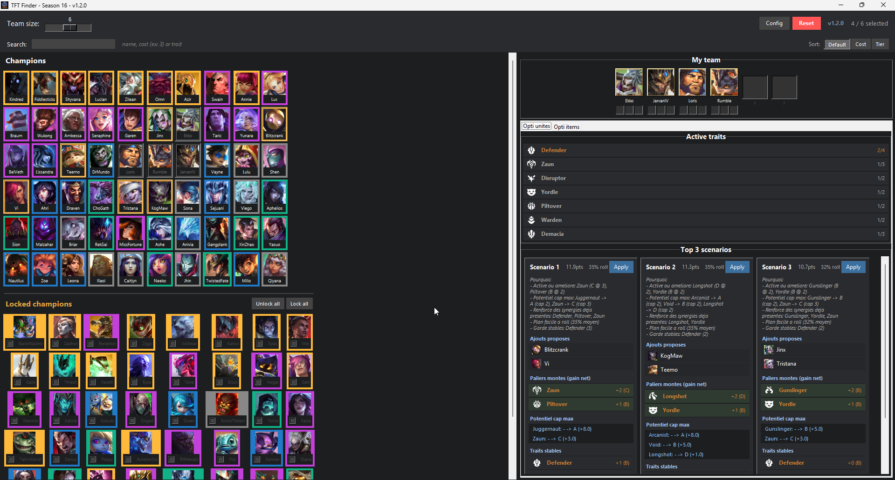
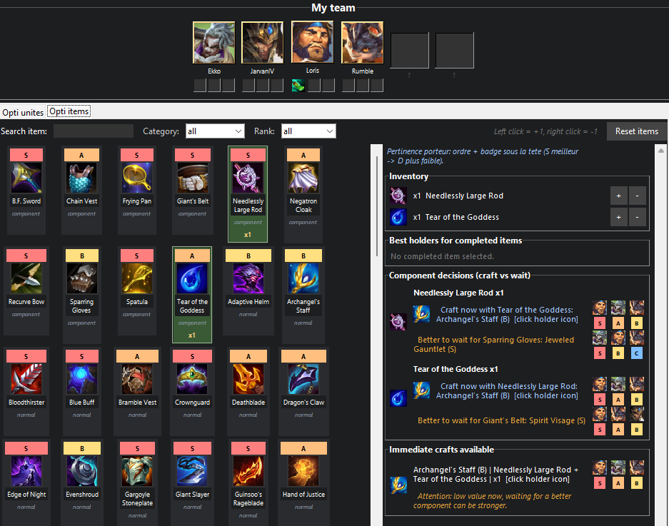

# TFT Finder

A tool to optimize your team composition in **Teamfight Tactics** (Season 16).
The app now includes:
- **Unit optimization** (best next champions to add)
- **Item optimization** (components, craft decisions, and best holders)

---

## For End Users

You can run the app directly with:

```
TFT-Finder-vX.Y.Z.exe
```

No Python installation is required for this mode.

## Requirements (source mode)

- **Python 3** installed on your PC ([download here](https://www.python.org/downloads/))
  - During installation, **make sure to check "Add Python to PATH"**
- **Pillow** (an image display library)

## Installation (source mode)

1. **Download the project** (green "Code" button > "Download ZIP" on GitHub, then unzip)

2. **Open a terminal** in the project folder
   - On Windows: right-click in the folder > "Open in Terminal"

3. **Install dependencies**:
   ```
   pip install -r src/requirements.txt
   ```
   > **pip not recognized?** pip is installed automatically with Python. If the command doesn't work:
   > - Make sure you checked **"Add Python to PATH"** during Python installation (otherwise, relaunch the Python installer > "Modify" > check the box)
   > - Try `python -m pip install -r src/requirements.txt` instead

## Running (source mode)

In the terminal, type:

```
python src/app.py
```

The application opens and loads all data from `src/data/`.

## Build a Windows `.exe`

You can build a standalone executable so users do not need Python installed.

1. Open a terminal in the project folder
2. Run:
   ```
   src\build_exe.bat
   ```
3. After build completes, share:
   ```
   TFT-Finder-vX.Y.Z.exe
   ```

Version is controlled in:
- `src/app.py` (`APP_VERSION`)

`src/build_exe.bat` reads `APP_VERSION` automatically from `src/app.py`.

## App icon and favicon files

- Source logo: `src/data/icons/logo_tft-finder.png`
- Windows app/exe icon: `src/data/icons/app.ico`
- Favicon files: `src/data/icons/favicon.ico` and `src/data/icons/favicon-32x32.png`

## Project layout

- Root (for non-technical users): `TFT-Finder-vX.Y.Z.exe`, `README`, `LICENSE`
- Source files: `src/`

## How it works

### Global UI

1. **Click champions** to add/remove them from your team.
2. `My team` is always visible at the top-right and is shared by both tabs.
3. Use the main **search bar** and **sort buttons** to filter/sort champions.
4. Adjust **team size** with the slider.
5. Use **Config** to adjust scoring weights, presets, and optional **constraints mode**:
   - `Keep champions`: units that should not be replaced in swap scenarios
   - `Avoid champions`: units you don't want in suggestions
   - `Force traits`: synergies that must be active in proposed scenarios
6. **Right click shortcuts**:
   - Right click a champion to set/remove `Keep` or `Avoid`
   - Right click an active trait to set/remove `Force trait`
   - Visual badges appear directly on names: lock symbol for keep/force, red cross for avoid

### Tab 1: `Opti unites`



1. View **active traits** with tier colors.
2. Get **Top 3 scenarios** for best next units.
3. Recommended champions are highlighted in the grid.
4. Click `Apply` on a scenario to apply its picks.

### Tab 2: `Opti items`



1. Filter items by **name**, **category**, and **rank**.
2. Add/remove inventory with item cards:
   - **Left click** = `+1`
   - **Right click** = `-1`
3. Inventory panel shows all selected components/items.
4. `Best holders for completed items`:
   - Shows holder suggestions for completed items in your inventory
   - `Equip best` equips directly on the best available unit
5. `Component decisions (craft vs wait)`:
   - Compares immediate craft vs waiting for a better component
   - Shows holder suggestions
6. `Immediate crafts available`:
   - Shows all crafts possible with current components
   - **To craft and equip on a specific champion, click the champion head icon** next to the suggestion

### Holder priority indicators

- Holder heads are ordered from best to less suitable.
- Each holder head has a badge (`S`, `A`, `B`, `C`, `D`) under it:
  - `S` = best holder for this item in current team context
  - lower grades = less optimal alternatives

### Team item slots

- Each champion in `My team` has **3 item slots max**.
- Equipping from suggestions updates slots directly.
- Click an equipped item under a champion to **unequip** it (returns to inventory).

## Data files (offline/autonomous)

All item logic is local (no dependency on `src/data/web` at runtime):
- `src/data/items.json`: item catalog (name, icon, nature, rank, bonus, recipe, recommended units)
- `src/data/components.json`: component matrix and craft results
- `src/data/images/items/`: item/component icons
- `src/data/units.json` and `src/data/traits.json`: champion/trait data

### Keyboard shortcuts

- **Escape**: deselect all

## License

This project is licensed under the **MIT License** - you are free to use, modify, and redistribute it as you wish. See the [LICENSE](LICENSE) file for details.
