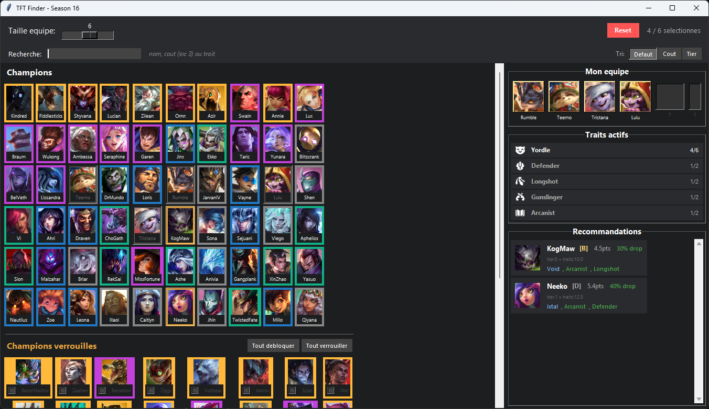

# TFT Finder

Un outil pour optimiser ta composition d'équipe dans **Teamfight Tactics** (Saison 16).
Tu sélectionnes tes champions, et l'outil te recommande le meilleur prochain personnage à acheter en fonction des synergies de traits, du tier des unités et des probabilités de drop.



---

## Prérequis

- **Python 3** installé sur ton PC ([télécharger ici](https://www.python.org/downloads/))
  - Pendant l'installation, **coche bien la case "Add Python to PATH"**
- **Pillow** (une librairie pour afficher les images)

## Installation

1. **Télécharge le projet** (bouton vert "Code" > "Download ZIP" sur GitHub, puis dézippe)

2. **Ouvre un terminal** dans le dossier du projet
   - Sur Windows : clic droit dans le dossier > "Ouvrir dans le terminal"

3. **Installe les dépendances** :
   ```
   pip install -r requirements.txt
   ```
   > **pip non reconnu ?** pip est installé automatiquement avec Python. Si la commande ne marche pas :
   > - Vérifie que tu as bien coché **"Add Python to PATH"** lors de l'installation de Python (sinon, relance l'installeur Python > "Modify" > coche la case)
   > - Essaie avec `python -m pip install -r requirements.txt` à la place

## Lancement

Dans le terminal, tape :

```
python app.py
```

L'application s'ouvre, c'est prêt !

## Comment ça marche

1. **Clique sur les champions** pour les ajouter à ton équipe
2. Utilise la **barre de recherche** pour filtrer par nom, coût ou trait
3. **Trie la grille** par défaut, coût ou tier avec les boutons de tri
4. Regarde les **traits activés** à droite (colorés bronze/blanc/or/prismatique selon le palier)
5. L'outil te propose les **meilleurs champions** pour compléter ton équipe
   - Les traits en **vert** sont ceux déjà dans ton équipe (synergie directe)
   - Le détail du score (tier + traits) est affiché sous chaque recommandation
   - Les champions recommandés sont **surlignés en orange** dans la grille
6. Clique sur une **recommandation** pour l'ajouter directement
7. Ajuste la **taille d'équipe** pour voir les probabilités de drop
8. **Config** : ouvre le panneau de configuration pour ajuster les poids du scoring (tier, synergies, odds, multi-synergie) ou utilise un **preset** (Equilibre, Synergie max, Brute force, Ignorer les odds)

### Raccourcis clavier

- **Ctrl+Z** : annuler la dernière action
- **Echap** : tout désélectionner

## Licence

Ce projet est sous licence **MIT** — tu es libre de l'utiliser, le modifier et le redistribuer comme tu veux. Voir le fichier [LICENSE](LICENSE) pour les détails.
